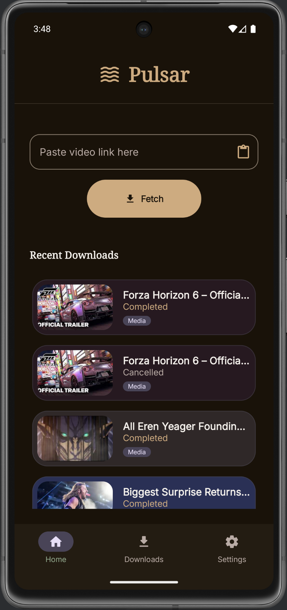
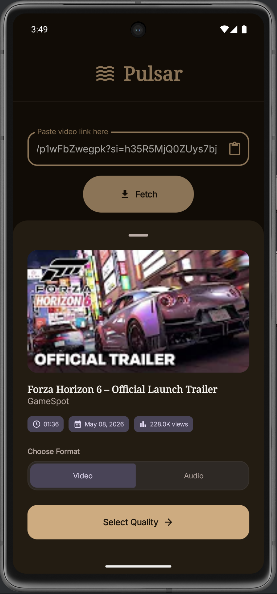
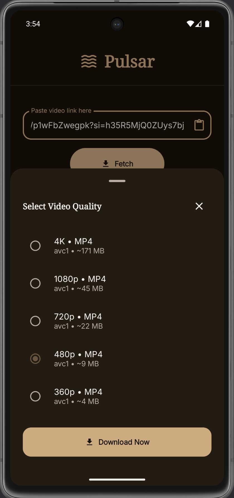
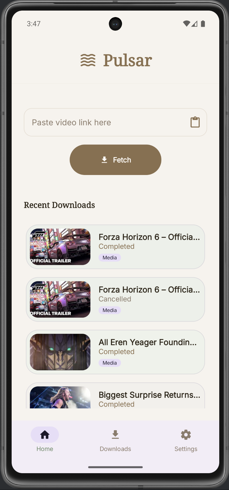
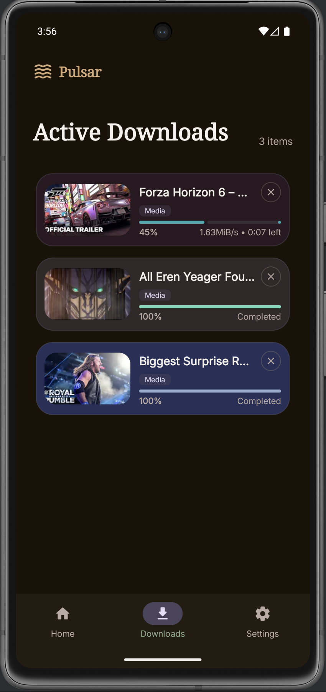
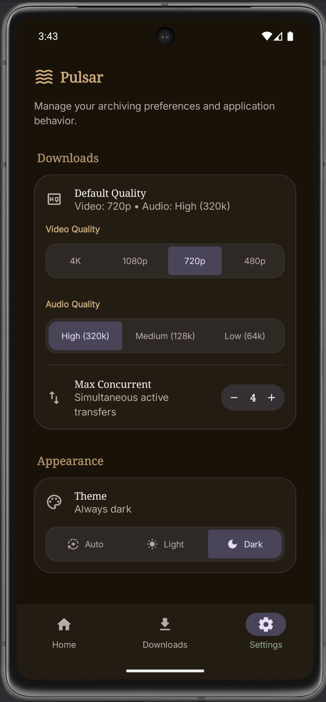

# Pulsar 🌌

<div align="center">
  <br />
  
  
  <h3 align="center">Your Universal Media Downloader</h3>

  <p align="center">
    A sleek, powerful Android application built with Jetpack Compose to handle all your video and audio downloading needs.
    <br />
    <a href="#-features"><strong>Explore Features »</strong></a>
    <br />
    <br />
    <a href="https://github.com/Aouni19/Pulsar/releases/tag/v1.2.0">Download APK</a>
    ·
    <a href="https://github.com/Aouni19/Pulsar/issues">Report Bug</a>
    ·
    <a href="https://github.com/Aouni19/Pulsar/issues">Request Feature</a>
  </p>
</div>

---

## 📱 About The Project

**Pulsar** is a modern, feature-rich media downloader for Android. Designed with **Kotlin** and **Jetpack Compose**, it offers a seamless and aesthetically pleasing user experience. Under the hood, Pulsar leverages powerful binaries to fetch, format, and download high-quality video and audio content from virtually anywhere on the web.

Whether you want to save a quick clip, download a full playlist, or extract just the audio in your preferred quality, Pulsar provides granular control with a beautiful interface that adapts perfectly to your device's theme.

### 📸 Interface Highlights

#### The Main Experience
<div align="center">
  
  &nbsp;&nbsp;&nbsp;&nbsp;
  
  &nbsp;&nbsp;&nbsp;&nbsp;
  
</div>

<br>

#### Light Mode & Settings
<div align="center">
  
  &nbsp;&nbsp;&nbsp;&nbsp;
  
  &nbsp;&nbsp;&nbsp;&nbsp;
  
</div>

---

## ✨ Key Featuresstill

* **🎥 Universal Downloading:** Fetch video and audio content efficiently using a powerful underlying binary engine.
* **⚙️ Granular Quality Control:** Choose your exact preferred formats, resolutions, and quality defaults before downloading.
* **📥 Active Download Manager:** Track progress in real-time, manage active queues, and view your completed history in a dedicated hub.
* **🛠️ Advanced Customization:** Pass custom flag arguments to the downloading engine for power-user flexibility.
* **🌓 Dynamic Theming:** Fully supports Material You dynamic colors along with beautiful custom Dark and Light modes.
* **⚡ Background Processing:** Reliable background downloads using Android's WorkManager, ensuring your downloads finish even if you leave the app.

---

## 📝 Version History

### [v1.2.0] - Expressive UI & Dynamic Media Cards
* **Redesigned UI Components**: Replaced standard toggles with a custom Material 3 Expressive `ConnectedButtonGroup` featuring dynamic, morphing pill animations.
* **Fluid Progress Indicators**: Introduced a custom `LinearWavyProgressIndicator` for a modern, fluid aesthetic during active downloads.
* **Dynamic Media Info**: The Recent Downloads card now dynamically extracts and displays accurate file sizes and video runtimes directly from the downloaded files.
* **Status Semantic Coloring**: Applied prominent, state-specific coloring (Green for Completed, Red for Failed, Orange for Cancelled) for immediate visual feedback.
* **Under-the-hood Polish**: Cleaned up codebase comments, enforced strict type safety, and implemented necessary Android 13+ foreground service permissions for rock-solid background downloading.

### [v1.0.0] - Initial Release
* **Universal Media Fetching**: Core engine implementation for downloading video and audio from multiple platforms.
* **Granular Quality Control**: Bottom sheet selectors for choosing exact formats, codecs, and resolutions.
* **Download Manager**: Real-time tracking of queued, active, and completed downloads via WorkManager.
* **Dynamic Theming**: Support for Material You and custom light/dark modes.
* **Advanced Settings**: Introduced Aria2c integration and custom downloader flags for power users.

---

## 🛠️ Built With

*  **Kotlin** - First-class, concise, and safe language for modern Android development.
*  **Jetpack Compose** - Android’s modern toolkit for building native UI declaratively.
* **Coroutines & Flow** - For asynchronous task management and reactive UI state.
* **WorkManager** - For guaranteed, persistent background download tasks.
* **Room Database** - Robust local data persistence for download history and metadata.
* **Hilt / Dagger** - For clean and scalable Dependency Injection.
* **Coil** - For fast and efficient image and thumbnail loading.

---

## 🚀 Getting Started

To get a local copy up and running, follow these simple steps.

### Prerequisites

* Android Studio (Latest stable recommended).
* JDK 17+.

### Installation

1.  Clone the repository
    ```sh
    git clone https://github.com/Aouni19/Pulsar.git
    ```
2.  Open the project in **Android Studio**.
3.  Allow Gradle to sync the dependencies.
4.  Run the app on an Emulator or Physical Device.

---

## 🤝 Contributing

Contributions make the open-source community an amazing place to learn, inspire, and create. Any contributions you make are **greatly appreciated**.

1.  Fork the Project
2.  Create your Feature Branch (`git checkout -b feature/AmazingFeature`)
3.  Commit your Changes (`git commit -m 'Add some AmazingFeature'`)
4.  Push to the Branch (`git push origin feature/AmazingFeature`)
5.  Open a Pull Request

---

## 📄 License

Distributed under the MIT License. See `LICENSE` for more information.

---

## 📧 Contact

**Aoun Raza** - [LinkedIn Profile](https://www.linkedin.com/in/aoun-raza-is-cool/)

Project Link: [https://github.com/Aouni19/Pulsar](https://github.com/Aouni19/Pulsar)
